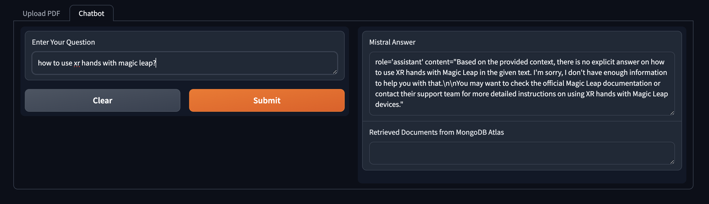
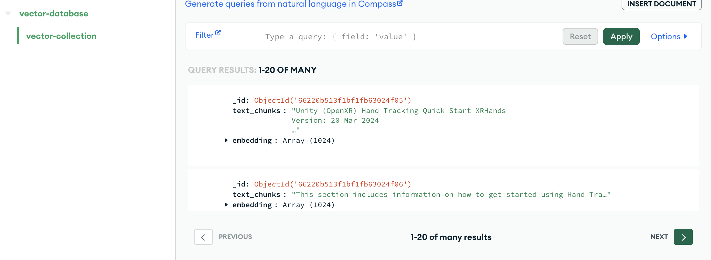

---

# Mistral AI and MongoDB Chatbot Integration

Source: https://www.mongodb.com/developer/products/mongodb/mistral-ai-integration/

This project integrates Mistral AI's powerful language model with MongoDB to create a responsive chatbot that can answer queries based on the context provided from uploaded documents. The integration involves processing PDF documents, storing their contents as embeddings in MongoDB, and using those embeddings to fetch relevant context for generating responses to user queries.

## How to Run

1. Ensure MongoDB is set up and accessible.
2. Store your Mistral AI API key and MongoDB URI in a `.env` file in the project directory.
3. Install required dependencies via `pip install -r requirements.txt`.
4. Run `python data_preparation.py sample.pdf` to process the PDF and store data in MongoDB.
5. Launch the Gradio interface with `python gradio_interface.py` to start the chatbot web application.
6. Open the local URL displayed in your terminal to interact with the chatbot.

Please make sure you have a file named `sample.pdf` in your project directory, or adjust the file path as needed when processing documents.

